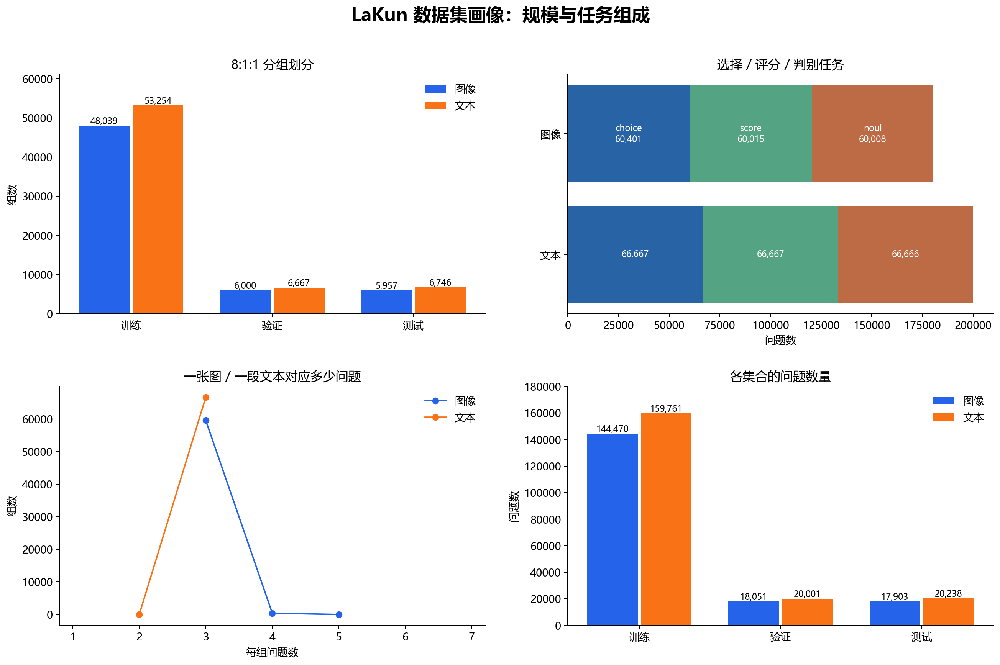
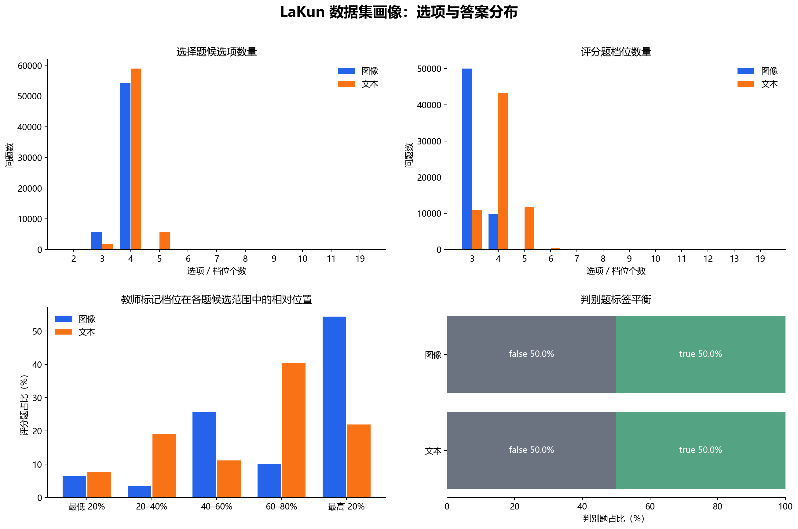

# LaKun：JEV 决策类型模型的多模态版本

[English](README.md) · 简体中文 · [Apache-2.0 许可](LICENSE) · [数据集完整统计](analysis/DATASET_PROFILE.md)

我从 JEV 得到灵感，也借鉴了 [Laya](https://github.com/mizorewww/laya-mlx) 的优化方式。最初我把它叫作 LaJ（谐音“垃圾”），后来为了致敬前辈，定名为 LaKun。LaKun 是我做的 JEV 决策类型模型的多模态版本：面对一段文本状态或一张图片，直接回答我指定的选择、档位评分和二元判断问题，输出每个候选项的 softmax 分数与最高分选项，不生成自由文本。一次调用可以同时提交三类问题，最多 20 题；目前每次最多处理一张图片。

## 一眼看懂

| 项目 | 当前实现与实测 |
|---|---|
| 输入 | 文本状态，或单张图片；每次 1–20 个类型化问题 |
| 问题 | `choice` 2–20 个候选项；`score` 3–20 档；`noul` 固定 `false/true` |
| 输出 | 每题的 `criteria`、`probabilities`、`predicted_index`；**概率尚未做校准验证** |
| 模型 | mmBERT-base + SigLIP SO400M + 视觉 token 桥接 + 决策头 |
| 参数量 | **756,409,158（约 0.756B）**，从本检查点 627 个张量逐项统计；`0.7B` 是仓库名中的近似称呼 |
| 权重体积 | `lakun.safetensors` **3,025,715,432 字节（2.82 GiB）**；完整推理目录约 **2.85 GiB** |
| 上下文 | 最多 512 token（图像预留 64 个视觉 token）；超限时自动截断，优先保留问题/候选项和状态开头 |

我联合微调了文本和视觉编码器，没有使用 Laya 已训练好的权重。决策头借鉴并保留了 Laya 衍生代码及许可证；因此 LaKun 的指标不能当作 Laya 的指标。

## 先跑起来

先安装与本机驱动匹配的 PyTorch，再从 PyPI 安装我的代码包。传入我的魔塔模型 ID，首次使用会自动下载并缓存完整权重；是否可下载以模型仓库当前权限为准，若需要访问权限，先运行 `ms-hub login`。随后按提示输入文本状态或图片路径，以及问题：

```bash
python -m pip install lakun
lakun --checkpoint hh108801/LaKun-0.7B
```

已有源码访问权限时，也可以在项目根目录改用以下入口：

```bash
python -m pip install -e .
python main.py
```

输出会显示最高分候选项和所有候选项的 softmax 分数。也可以把自行下载的完整权重目录传给 `--checkpoint`；目录应包含 `model_config.json`、权重文件、两座编码器的配置、tokenizer 和图像处理器。非交互调用时，再用 `--state` 或 `--image` 和问题参数输入一道题。

下面是真实 API 的三题同问示例；`state` 在这里输入，图片任务则通过 `image=` 传一张本地图片：

```python
from lakun import LaKunPredictor

model = LaKunPredictor.from_pretrained("hh108801/LaKun-0.7B")
result = model.predict(
    [
        {"type": "choice", "question": "这是什么类型的请求？", "criteria": ["咨询", "投诉", "退款"]},
        {"type": "score", "question": "这件事有多紧急？", "criteria": ["不紧急", "一般", "紧急"]},
        {"type": "noul", "question": "用户是否要求退款？", "criteria": ["false", "true"]},
    ],
    state="用户说：我被重复扣费了，请尽快退款。",
)
for answer in result["answers"]:
    print(answer["type"], answer["predicted_index"], answer["probabilities"])
```

`predict()` 返回可序列化为 JSON 的结构化 Python 字典。命令行入口显示的“答案：…”只是方便人阅读的文字，不在 API 返回值中。

`predicted_index` 从 0 开始，对应你传入的 `criteria` 顺序。`score` 目前返回**最高分档位的索引**，不是连续回归分数。这里的 `probabilities` 是候选项 softmax 值；我还没有做可靠的概率校准测试，不能把 `0.9` 理解为“现实中有 90% 的正确率”。

输入过长时，编码器会优先保留问题与候选项（过长的选项也会按预算缩短），再保留**状态文本开头**能装下的部分；被截掉的尾部不会参与判断。如果关键信息在后面，建议先压缩文本或分段提问。

## 我测到的效果

我按组划分训练、验证和测试集；选模型时只看验证损失，最终保留优化步 **16,882** 的检查点。在 **12,703 组 / 38,141 题**的留出测试集上，它与教师伪标签的一致率为：

| 类型 | 一致率 |
|---|---:|
| Choice | 83.11% |
| Score | 83.37% |
| Noul | 80.92% |

这些标签由 `qwen3.8-flash` 生成，**不是人工真值**；这里的数字不是通用准确率，也不能证明数值推理或图片理解的真实能力。最佳验证损失为 `0.014464`；第二轮训练损失继续下降时，验证损失反而上升，所以我保留第一轮末的权重并早停。损失和上面三个一致率是不同指标，不能互相替代。

### 本地推理速度

我用本项目完整检查点在 **Windows 11、NVIDIA GeForce RTX 3060 12GB、PyTorch 2.7.1+cu126、FP32 推理** 下测量。每种场景先预热 5 次，再串行执行 30 次；每次计时前后同步 CUDA。计时覆盖 `predict()` 的分词、图片读取与预处理、前向传播和结果整理；**不含**模型加载、下载或网络传输。这是固定输入上的延迟测试，不是准确率评估。

| 场景 | 平均耗时 | p95 耗时 |
|---|---:|---:|
| 纯文本·单题 | 17.33 ms | 19.23 ms |
| 纯文本·三题 | 18.19 ms | 18.65 ms |
| 单图·单题 | 163.06 ms | 168.69 ms |
| 单图·三题 | 168.88 ms | 171.59 ms |

## 我构建的数据集

我将图像和文本统一成“**一组状态 + 多道类型化问题**”的格式，问题标签全部来自 `qwen3.8-flash`。当前统计有 **126,663 组 / 380,424 题**：图像 59,996 组 / 180,424 题，文本 66,667 组 / 200,000 题。三类题数量接近，按组约 8:1:1 划分，保证同组问题不会跨训练、验证、测试集。



我在分析里还统计了候选项数量、评分档位、二元标签、7 个图像来源和 50 个文本方向。最值得警惕的是四选一的答案位置偏斜：图像题的 B 项占 **53.15%**、D 项仅 **1.74%**；文本题 B 项占 **46.48%**、D 项仅 **2.98%**。模型可能利用位置规律，而不是真正理解内容。



[查看其余两张图：来源/覆盖](analysis/figures/03-coverage.png) · [50 个文本方向及位置分布](analysis/figures/04-domains-and-choice-labels.png) · [完整频数与统计方法](analysis/DATASET_PROFILE.md)

我没有把训练 JSONL、图片或测试样本上传到 GitHub / 魔塔。图表是汇总统计，不包含那 1,000 组测试明细；原始图像来源和数据许可还需要逐项核对。

## 训练与复现

训练入口是 `train_lakun.py`。需要 Python 3.10+、可用的 CUDA PyTorch、`requirements-train.txt`、原始底座权重 `weights/mmbert-base/` 与 `weights/siglip-so400m-patch14-384/`，以及六份 `dataset/{image,text}_{train,val,test}.jsonl` 和图片。先做小样本流程检查，再开始全量训练：

```bash
python -m pip install -r requirements-train.txt
python train_lakun.py --train-groups 12 --val-groups 6 --test-groups 6 --epochs 1 --out runs/lakun_pilot
python train_lakun.py
```

训练默认使用本机可见 GPU（多卡为 DDP），每 3,000 优化步验证，最多 3 轮，连续 3 次验证损失未达到改进阈值则早停。检查点包含两座编码器和自定义决策模块；推理时要保留整个 `best/` 目录，不能只拿 `.safetensors`。当前检查点没有优化器状态，不能无损接着上次中断的优化步训练。详见 [`START.md`](START.md)。

## 我目前看到的局限

我把局限放在最后，也会在魔塔模型卡保留同样说明。LaKun 在**与训练数据接近的分布**上，对这三种类型化题目已有可用表现；我尤其觉得有明确数值线索、需要在候选项之间做简单推理的题目更容易答好，**但这只是目前试用观察，尚无独立分项测评支持**。另一方面，外部垃圾评论分类试验暴露出明显的跨领域迁移问题；第二轮训练损失下降而验证损失变差，也让我警惕过度专用化，甚至某种“微调坍塌”现象。现在还不能证明是底座能力真正坍塌，需要与未微调底座、不同检查点及人工标注域外集做对照。

因此我不会宣称它已经是通用分类器、强泛化视觉模型或可靠的数值推理模型。它目前只支持单张图片；答案位置偏斜、伪标签误差、未经校准的概率、跨域表现和来源许可，都是公开前要继续解决的问题。
