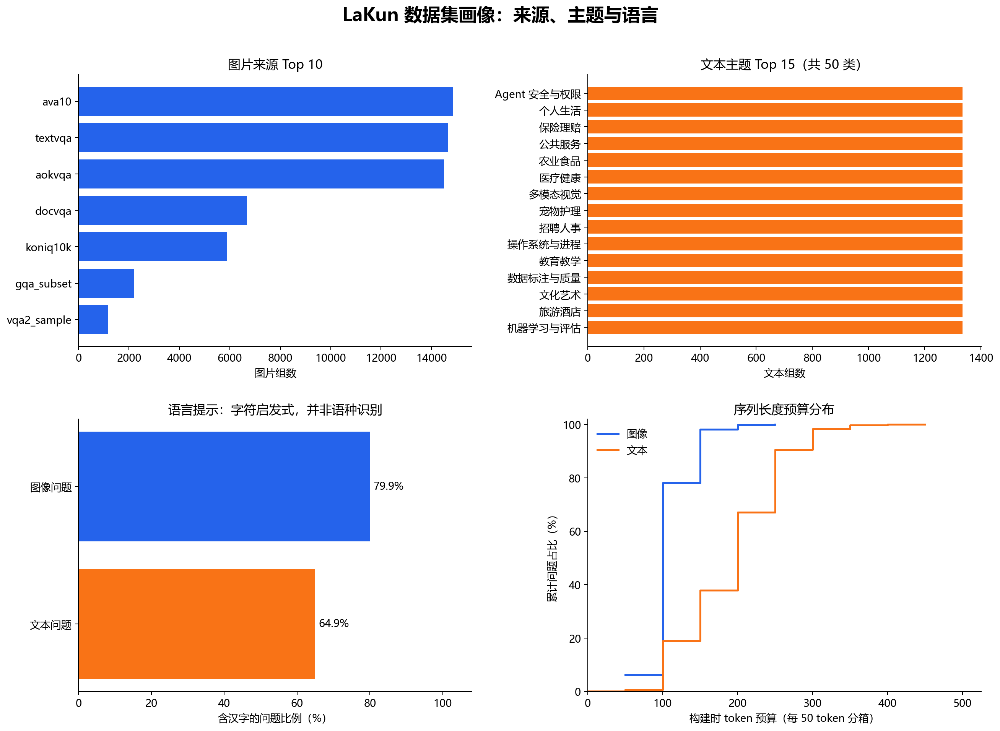
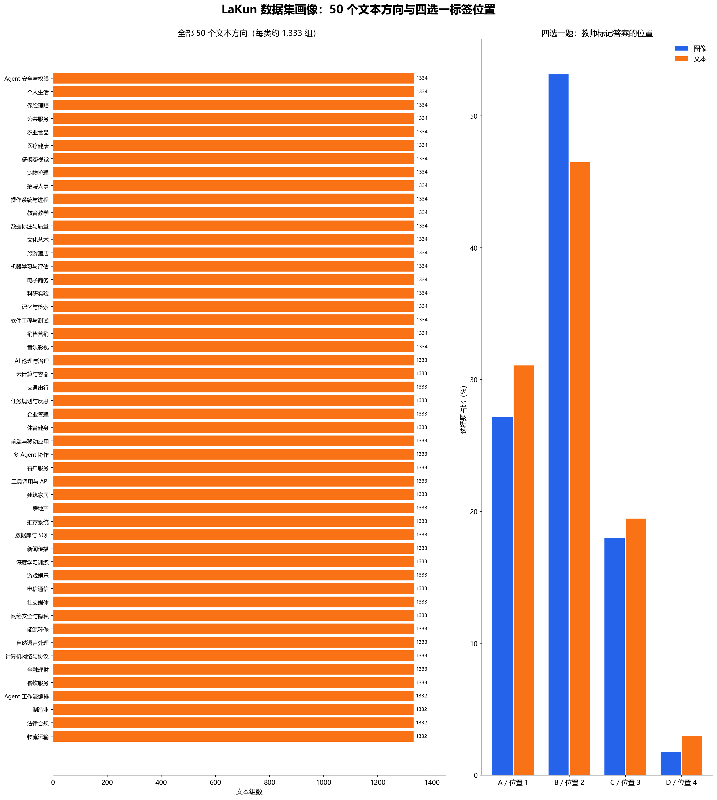

# LaKun 数据集画像

统计时间：2026-09-23。统计对象是 `dataset/` 中最终的图像、文本 `train/val/test` 六份 JSONL；单位区分为「组」（一张图片或一段文本）和「问题」（组内的一条选择、评分或判别任务）。此处的答案是模型生成的伪标签，不等同于人工核验的事实答案。本报告只介绍数据集的结构和分布，不包含模型训练或测试成绩。

## 一眼看懂

| 指标 | 图像 | 文本 | 合计 |
|---|---:|---:|---:|
| 组数 | 59,996 | 66,667 | 126,663 |
| 问题数 | 180,424 | 200,000 | 380,424 |
| 每组问题数 | 主要为 3 个；414 组为 4 个，11 组为 5 个 | 除 1 组为 2 个外，其余均为 3 个 | 平均约 3.00 个 |

| 划分 | 图像组 | 文本组 | 合计组 | 合计问题 |
|---|---:|---:|---:|---:|
| 训练 | 48,039 | 53,254 | 101,293 | 304,231 |
| 验证 | 6,000 | 6,667 | 12,667 | 38,052 |
| 测试 | 5,957 | 6,746 | 12,703 | 38,141 |

这相当于约 8:1:1 的**按组划分**，同一组的多个问题不会被拆到不同集合。

## 三类问题及候选项

| 任务 | 图像问题 | 文本问题 | 合计 |
|---|---:|---:|---:|
| Choice：候选项选择 | 60,401 | 66,667 | 127,068 |
| Score：分档评分 | 60,015 | 66,667 | 126,682 |
| Noul：二元判别 | 60,008 | 66,666 | 126,674 |

三类任务数量非常接近。判别题均为 `false/true` 两项；图像为 30,006/30,002，文本为 33,333/33,333，几乎严格平衡。选择题大多是四选一：图像 54,303/60,401（89.9%），文本 58,945/66,667（88.4%）。评分题图像以 3 档为主（50,017/60,015，83.3%），文本以 4 档为主（43,388/66,667，65.1%）。少量题有更多候选项，最高可到 19 项；推理端不能写死四选一。

## 来源、主题、语言与长度

图像来自 7 个来源，按组统计：`ava10` 14,863、`textvqa` 14,667、`aokvqa` 14,497、`docvqa` 6,681、`koniq10k` 5,889、`gqa_subset` 2,214、`vqa2_sample` 1,185。文本覆盖 50 个方向，每个方向 1,332–1,334 组，当前版本接近等量抽样。完整的 50 类名称和频数见 [stats.json](stats.json)。

图像问题中 144,240/180,424（79.9%）含汉字；文本问题中 129,846/200,000（64.9%）含汉字。这只是「是否包含至少一个汉字」的字符统计，**不是**中文/英文语种识别。记录的构建时 token 预算没有发现超过 512 的条目；图中按每 50 token 分箱，不代表实际模型 tokenizer 的精确截断长度。

## 必须注意的分布偏差

虽然三类任务数量接近平衡，**答案位置并不平衡**。只看最常见的四选一题：

| 教师标记位置 | 图像四选一 | 文本四选一 |
|---|---:|---:|
| A / 第 1 项 | 27.13% | 31.08% |
| B / 第 2 项 | 53.15% | 46.48% |
| C / 第 3 项 | 17.97% | 19.46% |
| D / 第 4 项 | 1.74% | 2.98% |

评分题也有偏斜：按「标签索引 ÷ (档位数−1)」映射到五等分后，图像评分落在最高 20% 的占 54.4%，文本为 21.9%。五等分是为了跨不同档位数比较；三档/四档本身是离散位置，中间区间可能自然较少。

因此，如果用原始选项顺序训练或评测模型，应注意模型可能学到答案位置规律。后续可另做「候选项随机打乱且同步调整标签」的对照实验，以及少量人工复核；本报告没有改动现有训练数据。

## 文件与复现

- [stats.json](stats.json)：所有完整频数和完整性检查结果。当前完整性异常计数为空字典 `{}`。
- [build_dataset_profile.py](build_dataset_profile.py)：从六份最终 JSONL 重建统计与四张图。

在项目根目录运行 `python -m analysis.build_dataset_profile` 可重新统计。
